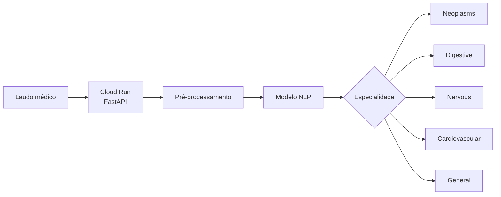

# 🩺 Automated Text Exam Triage


## Contexto

O projeto tem como objetivo construir um sistema de classificação automática de laudos médicos textuais, classificando cada exame de acordo com sua **especialidade médica**.

A API classifica as categorias que representam especialidades ou grupos médicos:

- `neoplasms`;
- `digestive`;
- `nervous`;
- `cardiovascular`;
- `general`.

O sistema utiliza um classificador de texto NLP leve, baseado em TF-IDF e regressão logística, com foco não apenas na qualidade da classificação, mas também na construção de um ciclo de vida completo de Machine Learning, incluindo treinamento, retreinamento, deploy, monitoramento, CI/CD e otimização de latência.

Para isso, será adotada uma **arquitetura híbrida**, combinando inferência **real-time** e processamento **batch**.

---

## Arquitetura

### Decisão entre Batch e Real-Time

A inferência principal será realizada em **real-time**, por meio de uma API REST executada no **Google Cloud Run**.

Essa escolha é motivada pela necessidade de classificar imediatamente a especialidade médica associada a um laudo recebido pelo sistema.

O fluxo esperado é:



O modelo será carregado em memória durante a inicialização da aplicação, evitando o custo de carregar o artefato do modelo a cada requisição.

O processamento **batch**, por outro lado, será utilizado nas etapas em que a resposta imediata não é necessária:
* retreinamento periódico;
* avaliação de novas versões do modelo;
* análise de drift;
* reprocessamento de laudos;
* geração de métricas offline;
* inferência sobre grandes volumes de dados.

> **Real-time será utilizado para inferência operacional, enquanto batch será utilizado para operações de treinamento, avaliação, monitoramento e processamento histórico.**

---

### Estratégia de Deploy em Nuvem Escolhida: GCP

Para este projeto, será utilizada a **Google Cloud Platform (GCP)**.

O serving da aplicação será realizado pelo Cloud Run, que executará o mesmo container Docker da API FastAPI. Essa escolha é adequada ao modelo utilizado, baseado em TF-IDF e regressão logística, pois se trata de um modelo leve, sem necessidade de GPU ou de uma plataforma especializada de serving.

A arquitetura proposta utiliza:


O **Cloud Run** será considerado o mecanismo principal para disponibilização da API de inferência real-time.

O **Artifact Registry** será utilizado para armazenar as imagens Docker produzidas pelo pipeline de CI/CD.

O **Cloud Storage** será utilizado para armazenar: datasets, artefatos de treinamento, modelos versionados, resultados de inferência batch, métricas e relatórios offline.

Essa escolha também mantém aberta a possibilidade de utilizar posteriormente o **Vertex AI Endpoint** caso surjam requisitos de MLOps mais avançados.

---

### Retreinamento e Processamento Batch

O **Airflow** será responsável pela orquestração dos processos periódicos.

Um DAG de retreinamento seguirá o fluxo:

```mermaid
flowchart LR
    A[Cloud Scheduler] --> B[Cloud Run Job]
    B --> C[Coleta dos dados]
    C --> D[Validação]
    D --> E[Pré-processamento]
    E --> F[Treinamento]
    F --> G[Avaliação]
    G --> H[Validação das métricas]
    H --> I[Versionamento do modelo]
    I --> J[Cloud Storage]
    J --> K[Deploy no Cloud Run]
```



O processamento batch também será utilizado para executar inferência sobre grandes conjuntos de laudos quando a resposta imediata não for necessária.

---

### CI/CD

O GitHub Actions será responsável pela automação do ciclo de entrega.

Dessa forma, alterações no código de inferência ou no pipeline de ML poderão ser validadas automaticamente antes de chegarem ao ambiente de produção.

---

### Arquitetura Final Proposta

A arquitetura inicial pode ser resumida da seguinte maneira:

```text
                         ┌─────────────────┐
                         │    GitHub       │
                         │    Actions      │
                         └────────┬────────┘
                                  │
                                  ▼
                         ┌─────────────────┐
                         │ Artifact        │
                         │ Registry        │
                         └────────┬────────┘
                                  │
                                  ▼
                        ┌───────────────────┐
                        │ Google Cloud Run  │
                        │                   │
                        │ FastAPI / HTTP    │
                        └─────────┬─────────┘
                                  │
                             POST /predict
                                  │
                                  ▼
                         ┌─────────────────┐
                         │ Classificador   │
                         │      NLP        │
                         └────────┬────────┘
                                  │
                                  ▼
                    neoplasms / digestive / nervous
                    cardiovascular / general


        ┌───────────────────────────────────────────────┐
        │                 MLOps                         │
        │                                               │
        │ Cloud Scheduler → Cloud Run Jobs              │
        │                                               │
        │ Treinamento → Avaliação → Versionamento       │
        │                                               │
        │ Cloud Storage → Modelos e datasets            │
        │                                               │
        │ Cloud Run Jobs → Inferência offline           │
        │                                               │
        │ Cloud Monitoring → Métricas e alertas         │
        │                                               │
        │ BigQuery → Análises históricas, se necessário │
        └───────────────────────────────────────────────┘
```

### Resumo da decisão

| Componente                       | Decisão                           |
| ------------------------------   | --------------------------------- |
| Inferência operacional           | **Real-time**                     |
| Processamento histórico          | **Batch**                         |
| API                              | **FastAPI / REST**                |
| Containerização                  | **Docker**                        |
| Cloud                            | **Google Cloud Platform**         |
| Serving                          | **Cloud Run Real-Time Inference** |
| Registry de imagens              | **Artifact Registry**             |
| Armazenamento de dados e modelos | **Cloud Storage**                 |
| Processamento batch              | **Cloud Run Jobs**                |
| Orquestração                     | **Airflow**                       |
| CI/CD                            | **GitHub Actions**                |
| Monitoramento                    | **Prometheus + Grafana**          |
| Modelo inicial                   | **TF-IDF + regressão logístic**   |
| Principal requisito de serving   | **Baixa latência**                |

A decisão final é, portanto, adotar uma **arquitetura híbrida no GCP**, utilizando **real-time inference para a classificação operacional das especialidades dos laudos** e **batch processing para treinamento, avaliação, reprocessamento e análises offline**.

Essa arquitetura atende simultaneamente aos requisitos funcionais do sistema de triagem e aos objetivos de MLOps do projeto, mantendo a solução simples o suficiente para ser implementada, testada e observada de ponta a ponta.

## Execução do projeto

As dependências são gerenciadas pelo `uv` e o projeto utiliza Python 3.12.7.

### Instalar dependências

```bash
uv sync
```

### Preparar os dados

```bash
uv run python scripts/prepare_medical_abstracts.py
```

Esse comando gera:

```text
data/laudos.csv
```

### Treinar o modelo

```bash
uv run python model/train.py
```

O modelo será salvo em:

```text
artifacts/medical_abstracts_model.joblib
```

### Executar a API localmente

```bash
uv run uvicorn app.main:app --reload
```

A API estará disponível em:

```text
http://127.0.0.1:8000
```

Teste a classificação:

```bash
curl -X POST http://127.0.0.1:8000/predict \
  -H "Content-Type: application/json" \
  -d '{
    "texto": "Paciente apresenta alterações no sistema cardiovascular."
  }'
```

Resposta esperada:

```json
{
  "classificacao": "cardiovascular"
}
```

### Executar com Docker

Construa a imagem:

```bash
docker build -t automated-text-exam-triage:local .
```

Execute o container:

```bash
docker run --rm \
  --name automated-text-exam-triage-api \
  -p 8000:8080 \
  automated-text-exam-triage:local
```

A API ficará disponível em:

```text
http://localhost:8000
```

### Testes

```bash
uv run pytest
```

O GitHub Actions, no push, roda lint (ruff) e pytest.

### Medir a latência

Com a API em execução:

```bash
uv run python scripts/measure_latency.py
```

Para salvar os resultados:

```bash
uv run python scripts/measure_latency.py \
  --output artifacts/latency-docker.json
```

O benchmark informa a latência mínima, média, mediana, P95 e máxima.

## Monitoramento

O arquivo `docker-compose.yml` inicia a API, o Prometheus, o Grafana e o Airflow:

```bash
docker compose up --build -d
```

Serviços disponíveis:
- API: http://localhost:8000
- Prometheus: http://localhost:9090
- Grafana: http://localhost:3000
- Airflow: http://localhost:8080

Credenciais padrão do Grafana:

```text
Usuário: admin
Senha: admin
```

Para popular os graficos:

```bash
uv run python scripts/generate_traffic.py --requests 200
```

será possível visualizar os painéis: Total de requisições, Latência média e P95, Taxa de erros HTTP 5xx e Requisições agrupadas por status HTTP.

## Otimização de inferência

O modelo treinado originalmente em scikit-learn é salvo em formato Joblib.
Também é realizada uma exportação para ONNX, executada com ONNX Runtime.

Para exportar o modelo:

```bash
uv run python scripts/export_model_onnx.py
```

### Comparação de latência

```bash
uv run python scripts/compare_model_latency.py \
  --warmup 10 \
  --requests 100
```

A comparação valida se o modelo Joblib e o modelo ONNX retornam a mesma classificação antes de medir o tempo de inferência.
Foram realizadas 100 inferências em cada modelo.

| Modelo | Requisições | Mínimo (ms) | Média (ms) | Mediana (ms) | P95 (ms) | Máximo (ms) |
|---|---:|---:|---:|---:|---:|---:|
| Joblib/scikit-learn | 100 | 3,365 | 3,566 | 3,508 | 3,827 | 4,06 |
| ONNX Runtime | 100 | 1,879 | 1,935 | 1,919 | 2,017 | 2,095 |

### Resultado

O modelo executado com ONNX Runtime apresentou menor latência em todas as métricas analisadas.

Considerando a latência média:

- Joblib/scikit-learn: **3,566 ms**
- ONNX Runtime: **1.935 ms**
- Redução média: **45,74%**
- Ganho de velocidade: aproximadamente **1,84x**

O modelo ONNX é utilizado para avaliação de desempenho. A API principal utiliza o artefato Joblib treinado.

## Deploy no GCP

A API foi publicada no **Google Cloud Run** utilizando uma imagem Docker armazenada no **Artifact Registry**.

A aplicação está disponível em:

- **API:** https://medical-exam-api-ppsmoa2pqq-uc.a.run.app
- **Swagger:** https://medical-exam-api-ppsmoa2pqq-uc.a.run.app/docs
- **Health check:** https://medical-exam-api-ppsmoa2pqq-uc.a.run.app/health
- **Métricas:** https://medical-exam-api-ppsmoa2pqq-uc.a.run.app/metrics

O serviço disponibiliza classificação de laudos médicos por especialidade por meio do endpoint `POST /predict`.

Para consultar detalhes sobre a arquitetura, endpoints, exemplos de uso, execução local, Docker e benchmark de latência, acesse:

[Documentação completa da API](docs/API.md)

## Orquestração com Airflow

O Airflow orquestra mensalmente:

1. A ingestão dos dados;
2. O retreinamento do modelo;
3. A publicação do modelo no Cloud Storage;
4. A atualização do serviço no Cloud Run.

O fluxo executado pela DAG é:

```text
ingest_data → train_model → publish_model
```

A DAG é executada no primeiro dia de cada mês, às 2h, no fuso America/Sao_Paulo.

Para iniciar o Airflow localmente:

```bash
docker compose up --build -d airflow
```

A interface está disponível em:

```text
http://localhost:8080
```

Para consultar a documentação completa de configuração, execução e manutenção:

[Documentação completa do Airflow](docs/AIRFLOW.md)
