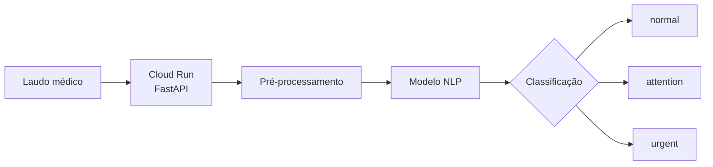
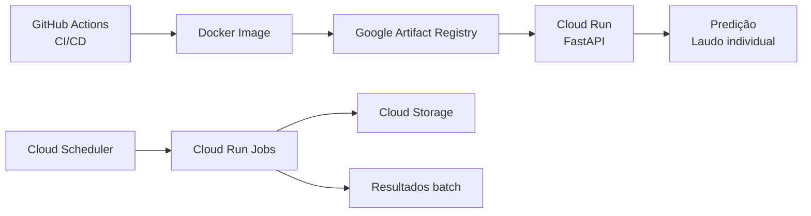

# 🛍️ Automated Text Exam Triage


## Contexto

O projeto tem como objetivo construir um sistema de triagem automática de laudos médicos textuais, classificando cada exame de acordo com seu nível de urgência:

* `normal`
* `attention`
* `urgent`

O sistema será desenvolvido como um classificador de texto NLP leve (TF-IDF + regressao logistica), com foco não apenas na qualidade da classificação, mas também na construção de um ciclo de vida completo de Machine Learning, incluindo treinamento, retreinamento, deploy, monitoramento, CI/CD e otimização de latência.

Para isso, será adotada uma **arquitetura híbrida**, combinando inferência **real-time** e processamento **batch**.

---
## Arquitetura


### Decisão entre Batch e Real-Time

A inferência principal será realizada em **real-time**, por meio de uma API REST executada no **Google Cloud Run**.

Essa escolha é motivada pela natureza do problema: um laudo chega ao sistema e a classificação de urgência deve estar disponível imediatamente para que possa ser utilizada no fluxo de triagem.

O fluxo esperado é:



O modelo será carregado em memória durante a inicialização da aplicação, evitando o custo de carregar o artefato do modelo a cada requisição.

O processamento **batch**, por outro lado, será utilizado nas etapas em que a resposta imediata não é necessária:
* retreinamento periódico;
* avaliação de novas versões do modelo;
* análise de drift;
* reprocessamento de laudos;
* geração de métricas offline;
* inferência sobre grandes volumes de dados.

> **Real-time será utilizado para inferência operacional, enquanto batch será utilizado para operações de treinamento, avaliação, monitoramento e processamento histórico.**

---

### Estratégia de Deploy em Nuvem Escolhida: GCP

Para este projeto, será utilizada a **Google Cloud Platform (GCP)**.

O serving da aplicação será realizado pelo Cloud Run, que executará o mesmo container Docker da API FastAPI. Essa escolha é adequada ao modelo utilizado, baseado em TF-IDF e regressão logística, pois se trata de um modelo leve, sem necessidade de GPU ou de uma plataforma especializada de serving.

A arquitetura proposta utiliza:


O **Cloud Run** será considerado o mecanismo principal para disponibilização da API de inferência real-time.

O **Artifact Registry** será utilizado para armazenar as imagens Docker produzidas pelo pipeline de CI/CD.

O **Cloud Storage** será utilizado para armazenar: datasets, artefatos de treinamento, modelos versionados, resultados de inferência batch, métricas e relatórios offline.

Essa escolha também mantém aberta a possibilidade de utilizar posteriormente o **Vertex AI Endpoint** caso surjam requisitos de MLOps mais avançados.

---

### Retreinamento e Processamento Batch

O **Airflow** será responsável pela orquestração dos processos periódicos.

Um DAG de retreinamento seguirá o fluxo:

```mermaid
flowchart LR
    A[Cloud Scheduler] --> B[Cloud Run Job]
    B --> C[Coleta dos dados]
    C --> D[Validação]
    D --> E[Pré-processamento]
    E --> F[Treinamento]
    F --> G[Avaliação]
    G --> H[Validação das métricas]
    H --> I[Versionamento do modelo]
    I --> J[Cloud Storage]
    J --> K[Deploy no Cloud Run]
```



O processamento batch também será utilizado para executar inferência sobre grandes conjuntos de laudos quando a resposta imediata não for necessária.

---

### CI/CD

O GitHub Actions será responsável pela automação do ciclo de entrega.

Dessa forma, alterações no código de inferência ou no pipeline de ML poderão ser validadas automaticamente antes de chegarem ao ambiente de produção.

---

### Arquitetura Final Proposta

A arquitetura inicial pode ser resumida da seguinte maneira:

```text
                         ┌─────────────────┐
                         │    GitHub       │
                         │    Actions      │
                         └────────┬────────┘
                                  │
                                  ▼
                         ┌─────────────────┐
                         │ Artifact        │
                         │ Registry        │
                         └────────┬────────┘
                                  │
                                  ▼
                        ┌───────────────────┐
                        │ Google Cloud Run  │
                        │                   │
                        │ FastAPI / HTTP    │
                        └─────────┬─────────┘
                                  │
                             POST /predict
                                  │
                                  ▼
                         ┌─────────────────┐
                         │ Classificador   │
                         │      NLP        │
                         └────────┬────────┘
                                  │
                                  ▼
                         normal / attention
                              / urgent


        ┌───────────────────────────────────────────────┐
        │                 MLOps                         │
        │                                               │
        │ Cloud Scheduler → Cloud Run Jobs              │
        │                                               │
        │ Treinamento → Avaliação → Versionamento       │
        │                                               │
        │ Cloud Storage → Modelos e datasets            │
        │                                               │
        │ Cloud Run Jobs → Inferência offline           │
        │                                               │
        │ Cloud Monitoring → Métricas e alertas         │
        │                                               │
        │ BigQuery → Análises históricas, se necessário │
        └───────────────────────────────────────────────┘
```

### Resumo da decisão

| Componente                       | Decisão                           |
| ------------------------------   | --------------------------------- |
| Inferência operacional           | **Real-time**                     |
| Processamento histórico          | **Batch**                         |
| API                              | **FastAPI / REST**                |
| Containerização                  | **Docker**                        |
| Cloud                            | **Google Cloud Platform**         |
| Serving                          | **Cloud Run Real-Time Inference** |
| Registry de imagens              | **Artifact Registry**             |
| Armazenamento de dados e modelos | **Cloud Storage**                 |
| Processamento batch              | **Cloud Run Jobs**                |
| Orquestração                     | **Airflow**                       |
| CI/CD                            | **GitHub Actions**                |
| Monitoramento                    | **Prometheus + Grafana**          |
| Modelo inicial                   | **TF-IDF + regressão logístic**   |
| Principal requisito de serving   | **Baixa latência**                |

A decisão final é, portanto, adotar uma **arquitetura híbrida no GCP**, utilizando **real-time inference para a triagem operacional dos laudos** e **batch processing para treinamento, avaliação, reprocessamento e análises offline**.

Essa arquitetura atende simultaneamente aos requisitos funcionais do sistema de triagem e aos objetivos de MLOps do projeto, mantendo a solução simples o suficiente para ser implementada, testada e observada de ponta a ponta.

### Execução do projeto

As dependências são gerenciadas pelo `uv` e o projeto utiliza Python 3.12.7.

#### Instalar dependências

```bash
uv sync
```

#### Preparar os dados

```bash
uv run python scripts/prepare_medical_abstracts.py
```

Esse comando gera:

```text
data/laudos.csv
```

#### Treinar o modelo

```bash
uv run python model/train.py
```

O modelo será salvo em:

```text
artifacts/medical_abstracts_model.joblib
```

#### Executar a API localmente

```bash
uv run uvicorn app.main:app --reload
```

Teste a classificação:
```bash
curl -X POST http://127.0.0.1:8000/predict \
  -H "Content-Type: application/json" \
  -d '{
    "texto": "Paciente apresenta alterações no sistema cardiovascular."
  }'
```

#### Executar com Docker

Construa a imagem:

```bash
docker build -t automated-text-exam-triage:local .
```

Execute o container:

```bash
docker run --rm \
  --name automated-text-exam-triage-api \
  -p 8000:8000 \
  automated-text-exam-triage:local
```

#### Testes

```bash
uv run pytest
```

GitHub Actions, no push, roda lint (ruff) e pytest.

#### Medir a latência

Com a API em execução, execute:

```bash
uv run python scripts/measure_latency.py
```

Para salvar os resultados:

```bash
uv run python scripts/measure_latency.py \
  --output artifacts/latency-docker.json
```

O benchmark informa a latência mínima, média, mediana, P95 e máxima.
