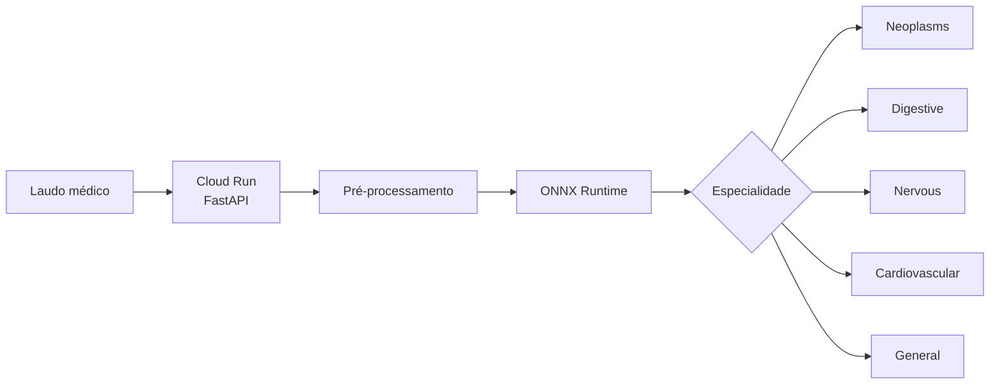
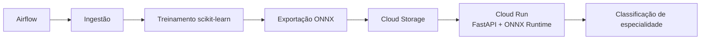
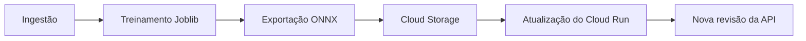

# 🩺 Automated Text Exam Triage


## Contexto

O projeto tem como objetivo construir um sistema de classificação automática de
laudos médicos textuais, classificando cada exame de acordo com sua
**especialidade médica**.

A API classifica as categorias retornadas representam especialidades ou grupos médicos:

- `neoplasms`;
- `digestive`;
- `nervous`;
- `cardiovascular`;
- `general`.

O sistema utiliza um classificador de texto NLP baseado em TF-IDF e regressão
logística. O treinamento é realizado com scikit-learn e o modelo é exportado
para ONNX Runtime para otimização da inferência em produção.

O projeto também contempla:

- treinamento e retreinamento periódico;
- exportação do modelo para ONNX;
- deploy no Google Cloud Run;
- monitoramento com Prometheus e Grafana;
- orquestração com Airflow;
- testes automatizados;
- CI/CD com GitHub Actions;
- benchmark de latência.

A arquitetura combina inferência **real-time** e processamento **batch**.

---

## Arquitetura

### Decisão entre Batch e Real-Time

A inferência principal é realizada em **real-time**, por meio de uma API REST
executada no **Google Cloud Run**.

O modelo ONNX é carregado durante a inicialização da aplicação e executado com ONNX Runtime,
evitando o custo de carregar e converter o modelo a cada requisição.

O fluxo de inferência é:



O processamento **batch** é utilizado nas etapas em que a resposta imediata não é necessária:

- retreinamento periódico;
- avaliação de novas versões do modelo;
- exportação para ONNX;
- análise de drift;
- reprocessamento de laudos;
- geração de métricas offline;
- inferência sobre grandes volumes de dados.

> Real-time é utilizado para a classificação operacional das especialidades,
> enquanto batch é utilizado para treinamento, avaliação, versionamento e
> processamento histórico.

### Estratégia de Deploy em Nuvem: GCP

O serving da aplicação é realizado pelo **Google Cloud Run**, que executa o container Docker
da API FastAPI.

O modelo Joblib é gerado durante o treinamento e utilizado como artefato intermediário.
Após o treinamento, ele é convertido para ONNX e publicado no Cloud Storage.
A API em produção carrega o modelo ONNX usando ONNX Runtime.



Os componentes utilizados são:

- **Cloud Run:** serving da API em tempo real;
- **Artifact Registry:** armazenamento da imagem Docker;
- **Cloud Storage:** armazenamento dos modelos versionados;
- **Airflow:** orquestração do retreinamento;
- **Prometheus e Grafana:** monitoramento local;
- **GitHub Actions:** testes e lint;
- **ONNX Runtime:** inferência otimizada.

---

### Retreinamento e processamento batch

O Airflow executa mensalmente o fluxo:



A DAG executa as seguintes tasks:

```text
ingest_data
    ↓
train_model
    ↓
export_model_onnx
    ↓
publish_model
    ↓
Cloud Run
```

---

### CI/CD

O GitHub Actions executa automaticamente:

- testes com `pytest`;
- lint com `ruff`;
- validações do código a cada `push`.

---

### Arquitetura final

```text
                         ┌─────────────────┐
                         │    GitHub       │
                         │    Actions      │
                         └────────┬────────┘
                                  │
                                  ▼
                         ┌─────────────────┐
                         │ Artifact        │
                         │ Registry        │
                         └────────┬────────┘
                                  │
                                  ▼
                        ┌───────────────────┐
                        │ Google Cloud Run  │
                        │                   │
                        │ FastAPI / HTTP    │
                        │ ONNX Runtime     │
                        └─────────┬─────────┘
                                  │
                             POST /predict
                                  │
                                  ▼
                         ┌─────────────────┐
                         │ Classificador   │
                         │      NLP        │
                         └────────┬────────┘
                                  │
                                  ▼
                    neoplasms / digestive / nervous
                    cardiovascular / general

        ┌───────────────────────────────────────────────┐
        │                    MLOps                      │
        │                                               │
        │ Airflow → Ingestão → Treinamento              │
        │                                               │
        │ Exportação ONNX → Cloud Storage               │
        │                                               │
        │ Cloud Storage → Cloud Run                     │
        │                                               │
        │ Prometheus + Grafana → Monitoramento local    │
        │                                               │
        │ Cloud Monitoring → Métricas de infraestrutura │
        └───────────────────────────────────────────────┘
```

### Resumo da decisão

| Componente | Decisão |
|---|---|
| Inferência operacional | **Real-time** |
| Tipo de classificação | **Especialidade médica** |
| Processamento histórico | **Batch** |
| API | **FastAPI / REST** |
| Containerização | **Docker** |
| Cloud | **Google Cloud Platform** |
| Serving | **Cloud Run** |
| Runtime de inferência | **ONNX Runtime** |
| Modelo de treinamento | **TF-IDF + regressão logística** |
| Artefato de treinamento | **Joblib** |
| Artefato de produção | **ONNX** |
| Registry de imagens | **Artifact Registry** |
| Armazenamento de modelos | **Cloud Storage** |
| Processamento batch | **Airflow** |
| CI/CD | **GitHub Actions** |
| Monitoramento local | **Prometheus + Grafana** |
| Principal requisito de serving | **Baixa latência** |

A decisão final é adotar uma arquitetura híbrida no GCP, utilizando real-time
inference para a classificação das especialidades dos laudos e batch processing
para treinamento, avaliação, exportação, versionamento e análises offline.

---

## Execução do projeto

As dependências são gerenciadas pelo `uv` e o projeto utiliza Python 3.12.7.

### Instalar dependências

```bash
uv sync
```

### Preparar os dados

```bash
uv run python scripts/prepare_dataset_medical_abstracts.py
```

Esse comando gera:

```text
data/laudos.csv
```

### Treinar o modelo

```bash
uv run python model/train.py
```

O modelo Joblib será salvo em:

```text
artifacts/medical_abstracts_model.joblib
```

### Exportar o modelo para ONNX

```bash
uv run python scripts/export_model_onnx.py
```

O modelo ONNX será salvo em:

```text
artifacts/medical_abstracts_model.onnx
```

### Executar a API localmente

Para utilizar o modelo ONNX localmente:

```bash
MODEL_FORMAT=onnx \
uv run uvicorn app.main:app \
  --host 127.0.0.1 \
  --port 8000
```

A API estará disponível em:

```text
http://127.0.0.1:8000
```

Teste a classificação:

```bash
curl -X POST http://127.0.0.1:8000/predict \
  -H "Content-Type: application/json" \
  -d '{
    "texto": "Paciente apresenta alterações no sistema cardiovascular."
  }'
```

Resposta esperada:

```json
{
  "classificacao": "cardiovascular"
}
```

### Executar com Docker

Construa a imagem:

```bash
docker build \
  -t automated-text-exam-triage:local \
  .
```

Execute o container:

```bash
docker run --rm \
  --name automated-text-exam-triage-api \
  -e MODEL_FORMAT=onnx \
  -p 8000:8080 \
  automated-text-exam-triage:local
```

A API ficará disponível em:

```text
http://localhost:8000
```

### Testes

```bash
uv run pytest
```

O GitHub Actions executa automaticamente:

- lint com `ruff`;
- testes com `pytest`.

---

## Monitoramento

O arquivo `docker-compose.yml` inicia a API, o Prometheus, o Grafana e o Airflow:

```bash
docker compose up --build -d
```

Serviços disponíveis:

- API: http://localhost:8000;
- Prometheus: http://localhost:9090;
- Grafana: http://localhost:3000;
- Airflow: http://localhost:8080.

Credenciais padrão do Grafana:

```text
Usuário: admin
Senha: admin
```

Para popular os gráficos:

```bash
uv run python scripts/generate_traffic.py \
  --url http://localhost:8000/predict \
  --requests 200
```

Os painéis apresentam:

- total de requisições;
- latência média;
- latência P95;
- taxa de erros HTTP 5xx;
- requisições agrupadas por status HTTP.

[Prints do dashboard Grafana e do Prometheus](docs/monitoring.md)

---

## Otimização de inferência

O modelo é treinado originalmente com scikit-learn utilizando:

```text
TF-IDF + Logistic Regression
```

O pipeline treinado é salvo em Joblib:

```text
artifacts/medical_abstracts_model.joblib
```

Em seguida, o modelo é exportado para ONNX e executado com ONNX Runtime:

```text
artifacts/medical_abstracts_model.onnx
```

O modelo ONNX é utilizado pela API em produção.

O modelo Joblib permanece como:

- artefato intermediário do treinamento;
- referência para validação;
- fallback;
- base para exportação ONNX.

### Exportar o modelo

```bash
uv run python scripts/export_model_onnx.py
```

### Comparar os modelos

```bash
uv run python scripts/compare_model_latency.py \
  --warmup 10 \
  --requests 100
```

A comparação valida se o modelo Joblib e o modelo ONNX retornam a mesma
classificação antes de medir o tempo de inferência.

### Benchmark local

Foram realizadas 100 inferências em cada modelo:

| Modelo | Requisições | Mínimo (ms) | Média (ms) | Mediana (ms) | P95 (ms) | Máximo (ms) |
|---|---:|---:|---:|---:|---:|---:|
| Joblib/scikit-learn | 100 | 3,365 | 3,566 | 3,508 | 3,827 | 4,060 |
| ONNX Runtime | 100 | 1,879 | 1,935 | 1,919 | 2,017 | 2,095 |

Considerando a latência média:

- Joblib/scikit-learn: **3,566 ms**;
- ONNX Runtime: **1,935 ms**;
- Redução média: **45,74%**;
- Ganho de velocidade: aproximadamente **1,84x**.

### Benchmark no Cloud Run

Foram realizadas 100 requisições ao endpoint `/predict`, após 10 requisições
de aquecimento. Todas as requisições retornaram `HTTP 200`.

| Métrica | Valor |
|---|---:|
| Requisições | 100 |
| Latência mínima | 166,885 ms |
| Latência média | 173,961 ms |
| Mediana | 171,603 ms |
| P95 | 183,357 ms |
| Latência máxima | 312,267 ms |

O resultado foi salvo em:

```text
benchmarks/latency-cloud-run-onnx.json
```

A latência no Cloud Run inclui:

- comunicação HTTP;
- rede;
- processamento da API;
- middleware;
- serialização da resposta;
- inferência com ONNX Runtime;
- infraestrutura do Cloud Run.

Por isso, ela não deve ser comparada diretamente com a latência isolada da inferência local.

---

## Deploy no GCP

A API foi publicada no **Google Cloud Run** utilizando uma imagem Docker armazenada no **Artifact Registry**.

A aplicação utiliza o modelo ONNX publicado no Cloud Storage.

A aplicação está disponível em:

- **API:** https://medical-exam-api-ppsmoa2pqq-uc.a.run.app
- **Swagger:** https://medical-exam-api-ppsmoa2pqq-uc.a.run.app/docs
- **Health check:** https://medical-exam-api-ppsmoa2pqq-uc.a.run.app/health
- **Métricas:** https://medical-exam-api-ppsmoa2pqq-uc.a.run.app/metrics

O serviço disponibiliza classificação de laudos médicos por especialidade por
meio do endpoint `POST /predict`.

A configuração atual do Cloud Run utiliza:

```text
MODEL_FORMAT=onnx
MODEL_URI=gs://quantum-balm-260822-medical-models/models/medical_abstracts_model_*.onnx
```

### Testar a API publicada

```bash
curl -X POST \
  https://medical-exam-api-ppsmoa2pqq-uc.a.run.app/predict \
  -H "Content-Type: application/json" \
  -d '{
    "texto": "Paciente apresenta alterações no sistema cardiovascular."
  }'
```

Resposta esperada:

```json
{
  "classificacao": "cardiovascular"
}
```

Para consultar detalhes sobre a arquitetura, endpoints, exemplos de uso,
execução local, Docker e benchmark de latência, acesse:

[Documentação completa da API](docs/API.md)

---

## Orquestração com Airflow

O Airflow orquestra mensalmente:

1. A ingestão dos dados;
2. O retreinamento do modelo Joblib;
3. A exportação do modelo para ONNX;
4. A publicação do modelo no Cloud Storage;
5. A atualização do serviço no Cloud Run.

O fluxo executado pela DAG é:

```text
ingest_data
    ↓
train_model
    ↓
export_model_onnx
    ↓
publish_model
    ↓
Cloud Run
```

A DAG é executada no primeiro dia de cada mês, às 2h, no fuso
`America/Sao_Paulo`.

Para iniciar o Airflow localmente:

```bash
docker compose up --build -d airflow
```

A interface está disponível em:

```text
http://localhost:8080
```

Para consultar a documentação completa de configuração, execução e manutenção:

[Documentação completa do Airflow](docs/AIRFLOW.md)
