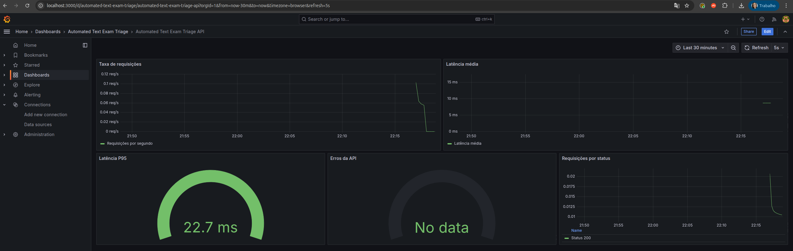
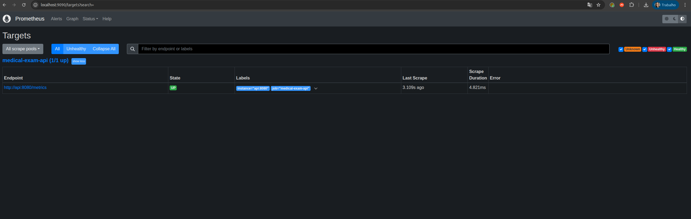

# Monitoramento

Screenshot tirados após:

```bash
docker compose up --build -d
```

e gerar tráfego:

```bash
uv run python scripts/generate_traffic.py --requests 200
```

ou

```bash
uv run python scripts/generate_traffic.py \
  --url https://medical-exam-api-ppsmoa2pqq-uc.a.run.app/predict \
  --requests 200
```

## Grafana — dashboard "Automated Text Exam Triage API"



5 paineis, populados com tráfego real: Taxa de requisições, Latencia média, Latência P95,
Erros na API e Requisições por status da API.

## Prometheus — target da API



Confirma em `http://api:8080/metrics`, target `UP`.
